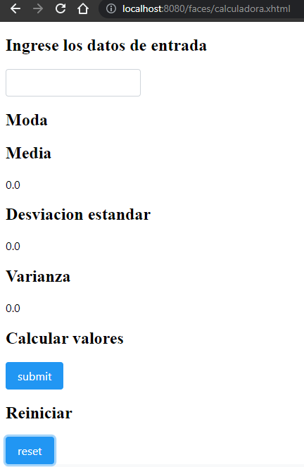

## Lab05 CVDS    

### PARTE I. - JUGANDO A SER UN CLIENTE HTTP

- **Abra una terminal Linux o consola de comandos Windows.**
**Realice una conexión síncrona TCP/IP a través de Telnet al siguiente servidor:**
**Host: www.escuelaing.edu.co**
**Puerto: 80**
**Teniendo en cuenta los parámetros del comando telnet: telnet HOST PORT**

- **Revise la página 36 del RFC del protocolo HTTP, sobre cómo realizar una petición GET. Con esto, solicite al servidor el recurso ‘sssss/abc.html’, usando la versión 1.0 de HTTP.**
**Asegúrese de presionar ENTER dos veces después de ingresar el comando.**

- **Revise el resultado obtenido. ¿Qué codigo de error sale?, revise el significado del mismo en la lista de códigos de estado HTTP.**

- **¿Qué otros códigos de error existen?, ¿En qué caso se manejarán?**

- **Realice una nueva conexión con telnet, esta vez a:**
  Host: www.httpbin.org
  Puerto: 80
  Versión HTTP: 1.1
  Ahora, solicite (GET) el recurso /html. ¿Qué se obtiene como resultado?

  
  

- **Seleccione el contenido HTML de la respuesta y copielo al cortapapeles CTRL-SHIFT-C. Ejecute el comando wc (word count) para contar palabras con la opción -c para contar el número de caracteres:**   wc -c  
  **Pegue el contenido del portapapeles con CTRL-SHIFT-V y presione CTRL-D (fin de archivo de Linux). Si no termina el comando wc presione CTRL-D de nuevo. No presione mas de dos veces CTRL-D indica que se termino la entrada y puede cerrarle la terminal. Debe salir el resultado de la cantidad de caracteres que tiene el contenido HTML que respondió el servidor.**

  
  
  

  

- **Claro está, las peticiones GET son insuficientes en muchos casos. Investigue: ¿Cuál es la diferencia entre los verbos GET y POST? ¿Qué otros tipos de peticiones existen?**

  **GET** se encarga de llevar los datos de forma "visible" (cualquiera puede verlos) al cliente por medio de la URL.

  **POST** trata con datos "ocultos" (el cliente no puede verlos) enviados por un formulario.

  **HEAD** solicita una respuesta idéntica a la de una petición GET, pero sin el cuerpo de la respuesta.

  **PUT** reemplaza todas las representaciones actuales del recurso de destino con la carga útil de la petición.

  **DELETE** borra un recurso en específico.

  **CONNECT** establece un túnel hacia el servidor identificado por el recurso.

  **OPTIONS** para describir las opciones de comunicación para el recurso de destino.

  **TRACE** realiza una prueba de bucle de retorno de mensaje a lo largo de la ruta al recurso de destino.

  **PATCH** utilizado para aplicar modificaciones parciales a un recurso.

- **En la practica no se utiliza telnet para hacer peticiones a sitios web sino el comando curl con ayuda de la linea de comandos:**   curl www.httpbin.org  
  
  
- **Utilice ahora el parámetro -v y con el parámetro -i:**   curl -v www.httpbin.org  
  
- **curl -i** www.httpbin.org  
  

- **¿Cuáles son las diferencias con los diferentes parámetros?**   El parametro -i sirve para incluir el encabezado del protocolo en el outout
  El parametro -v sirve para que curl se vuelva más "explicativo" y adicione informacion de pruebas y señale estas con el prefijo "*"

### PARTE II. - HACIENDO UNA APLICACIÓN WEB DINÁMICA A BAJO NIVEL.

- **Revise la clase SampleServlet incluida a continuacion, e identifique qué hace**   Sirve como un controlador que por el momento solo tiene un método GET

- **Revise en el pom.xml para qué puerto TCP/IP está configurado el servidor embebido de Tomcat (ver sección de plugins).**   Está configurado para funcionar por el puerto 8080

- **mvn package**  

- **mvn tomcat7:run**

- **Abra un navegador, y en la barra de direcciones ponga la URL con la cual se le enviarán peticiones al ‘SampleServlet’. Tenga en cuenta que la URL tendrá como host ‘localhost’, como puerto, el configurado en el pom.xml y el path debe ser el del Servlet. Debería obtener un mensaje de saludo.**

- **Observe que el Servlet ‘SampleServlet’ acepta peticiones GET, y opcionalmente, lee el parámetro ‘name’. Ingrese la misma URL, pero ahora agregando un parámetro GET (si no sabe como hacerlo, revise la documentación en http://www.w3schools.com/tags/ref_httpmethods.asp).**

- **En el navegador revise la dirección https://jsonplaceholder.typicode.com/todos/1. Intente cambiando diferentes números al final del path de la url.**

- **Una vez hecho esto, verifique el funcionamiento de la aplicación, recompile y ejecute la aplicación.**
**Intente hacer diferentes consultas desde un navegador Web para probar las diferentes funcionalidades**

- **Revise este ejemplo de validación de formularios con javascript y agruéguelo a su formulario, de manera que -al momento de hacer ‘submit’- desde el browser se valide que el valor ingresado es un valor numérico.**

  

  

- **Qué diferencia observa al usar *POST* y *GET*?**  
Al utilizar el método **GET** el input debe tener el mismo nombre del parametro que recibe mientras que el **POST**  no recibe parametros y no devuelve nada al formulario. 

- **¿Qué se está viendo implementación de los métodos de la clase Service?**
El metodo **getTodo** hace un llamado a la URL para que devuelva una lista con los elementos en formato .json, **todoToHTMLRow** se encarga de construir la organización de cada fila de la tabla para que en **todosToHTMLTable** una todas las filas y devuelva la de forma completa y permita ir agregando filas en cada actualización.

- **Abra la aplicación en un explorador. Realice algunas pruebas de aceptación con la aplicación. **
**Al hacer click en submit**

**Al hacer click en reset**

- **Abra la aplicación en dos computadores diferentes. Si no dispone de uno, hágalo en dos navegadores diferentes (por ejemplo Chrome y Firefox; incluso se puede en un único navegador usando una ventana normal y una ventana de incógnito / privada). Haga cinco intentos en uno, y luego un intento en el otro. ¿Qué valor tiene cada uno?** 
 
*Al abrir la aplicacion en Google Chrome*

*Al abrir la aplicacion en Edge*

*Al abrir la aplicacion en Incognito*

Al abrir la aplicacion en diferentes navegadores se guardan los datos anteriormente ingresados en los otros navegadores

- **Aborte el proceso de Tomcat-runner haciendo Ctrl+C en la consola, y modifique el código del backing-bean de manera que use la anotación @SessionScoped en lugar de @ApplicationScoped. Reinicie la aplicación y repita el ejercicio anterior.
Dado la anterior, ¿Cuál es la diferencia entre los backing-beans de sesión y los de aplicación?**
 
La diferencia es que ya no se guardan los datos ingresados en otros navegadores

- **Ubique el código HTML generado por el servidor**

- **Busque el elemento oculto, que contiene el número generado aleatoriamente**

- En la sección de estilos, deshabilite el estilo que oculta el elemento para que sea visible.
- Observe el cambio en la página, cada vez que se realiza un cambio en el estilo.
- Revise qué otros estilos se pueden agregar a los diferentes elementos y qué efecto tienen en la visualización de la página.
- Actualice la página. Los cambios de estilos realizados desaparecen, pues se realizaron únicamente en la visualización, la respuesta del servidor sigue siendo la misma, ya que el contenido de los archivos allí almacenados no se ha modificado.
- Revise qué otros cambios se pueden realizar y qué otra información se puede obtener de las herramientas de desarrollador.
